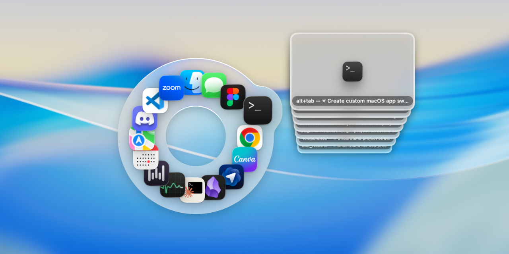
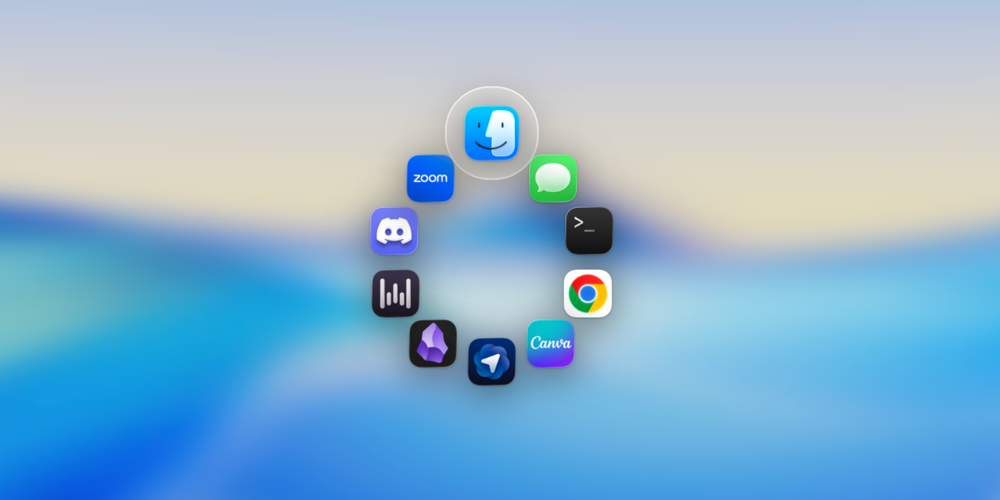

# Halo

**A Liquid-Glass ring that replaces ⌘⇥ (Command-Tab) on macOS Tahoe.**

Halo is a menu-bar app for macOS 26 (Tahoe). Press **⌘⇥** (Command-Tab) once and a
glowing ring ("donut") of your running-app icons blooms around the cursor. Hover
an icon to float it out and reveal a stack of live window previews; slide onto the
stack to fan them out; click one to jump straight to that exact window. Press
**⌘⇥** (Command-Tab) again (or Escape, or click outside) to dismiss — it's a
toggle, no holding.

It's built entirely on the native macOS 26 Liquid Glass APIs (`.glassEffect` /
`GlassEffectContainer`): the ring opens with a spring (icons compress into a
single glass sphere, then spring outward), each hovered icon grows a rounded
glass bulge with a specular sheen and edge outline, and an optional
whole-screen backdrop blur sits behind it all.





## Features

- **⌘⇥ (Command-Tab) toggle.** Halo intercepts and swallows ⌘⇥ (Command-Tab) at
  the HID level so the native switcher never appears — the ring toggles instead.
  No holding the key down.
- **Opens on the cursor.** The ring blooms exactly where your pointer is.
- **Liquid Glass throughout.** Native macOS 26 `.glassEffect` /
  `GlassEffectContainer`, with a spring open/close (icons compress into one glass
  sphere, then spring out), a rounded glass "bulge" on hover, a specular sheen,
  and an edge outline that hugs the bulge↔ring junction.
- **Live window previews.** Hover an icon and a stack of that app's windows
  appears; slide onto the stack and the previews fan out. Click a preview to
  raise that exact window — across Spaces.
- **MRU ordering.** Apps are ordered most-recently-used, so the last app you
  used is right next to the cursor.
- **Lone-⌘ (Command) recenter.** A single ⌘ (Command) tap while the ring is open
  glides it to recenter on the current cursor position (even onto another display).
- **Optional screen blur.** A whole-screen backdrop blur behind the ring, with
  named levels in the menu bar (No blur / Subtle / Medium / Strong / Maximum).
- **Menu-bar control.** Permission status, a "Show ring" toggle, and the screen-
  blur submenu. The "Show ring" and "Screen blur" choices persist across
  launches.
- **In-app updates.** A **Check for Updates…** menu item compares your build
  against the latest GitHub release and, on confirmation, downloads the new
  signed app, swaps it in place, and relaunches — keeping your Accessibility
  grant intact.
- **Graceful previews.** Without Screen Recording, previews fall back to clean
  app-icon cards — the switcher still works.

## Requirements

- **macOS 26 (Tahoe)** — Halo is macOS 26 only. It uses the native Liquid Glass
  APIs and `.macOS(.v26)`, which require Tahoe.
- **Apple Silicon Mac.**
- **An Apple Development signing certificate** in your keychain (to build). A
  stable code identity is what keeps the Accessibility grant alive across
  rebuilds — see [Install / Build](#install--build).
- Swift 6.2+ toolchain (Xcode 26 / its command-line tools).

## Install / Build

Halo is built from source with Swift Package Manager.

```sh
git clone https://github.com/arshawnarbabi/Halo.git
cd Halo
./Scripts/build.sh release
```

The build script compiles with SwiftPM, assembles a `.app` bundle, code-signs
it, and launches it. The app lands at:

```
build/Halo.app
```

Other invocations:

```sh
./Scripts/build.sh debug            # faster debug build, assemble, sign, launch
./Scripts/build.sh release nolaunch # build + sign, but don't open it
```

### Downloaded `Halo.app.zip` instead? ("Apple could not verify…")

If you grab a prebuilt `Halo.app.zip` from [Releases](https://github.com/arshawnarbabi/Halo/releases)
instead of building from source, macOS will block the first launch with
*"Apple could not verify 'Halo' is free of malware."* That's expected: the
release is signed with an Apple Development certificate, not a notarized
Developer ID one, and Gatekeeper only waves through the latter for downloaded
apps. Two ways past it:

1. **Terminal (recommended).** Move `Halo.app` to `/Applications`, then strip
   the quarantine flag:

   ```sh
   xattr -dr com.apple.quarantine /Applications/Halo.app
   ```

   This is the better route for Halo specifically — it also prevents Gatekeeper
   **App Translocation** (running the app from a random read-only path), which
   would break the TCC permission identity and the in-app updater.

2. **System Settings.** Try to open Halo once (let it get blocked), then go to
   **System Settings ▸ Privacy & Security**, scroll down to the "Halo was
   blocked" notice, and click **Open Anyway**. (On macOS 26 the old
   right-click ▸ Open bypass no longer works for unnotarized apps.)

### Signing (why it matters)

The script signs with an **Apple Development** certificate so the code identity
is stable. This makes the macOS TCC designated requirement identifier- and
leaf-certificate-based, so your **Accessibility (and Screen Recording) grant
survives rebuilds**. Ad-hoc signing (`codesign --sign -`) would change the
cdhash on every build, which silently invalidates the Accessibility grant and
forces you to re-grant each time — so the script refuses to ad-hoc sign and
fails loudly if no stable identity is found.

By default the script auto-detects the first **Apple Development** identity in
your keychain. To pin a specific one, set `HALO_SIGN_ID`:

```sh
HALO_SIGN_ID="<your codesigning identity>" ./Scripts/build.sh release
```

Find a valid identity with `security find-identity -v -p codesigning`.

### First launch

1. Launch via the `.app` (`open build/Halo.app` or Finder) — not the raw
   binary inside `Contents/MacOS`. Launching the raw binary makes it inherit the
   terminal's TCC attribution and misreport permissions.
2. From the menu-bar icon, grant **Accessibility** (required). Each row deep-links
   to the correct System Settings pane.
3. Optionally grant **Screen Recording** (for live window previews).
4. Press **⌘⇥** (Command-Tab).

The first time Accessibility is granted to an already-running process, the
kernel may still refuse to create the event tap; Halo relaunches itself once so
the fresh process starts trusted. If a grant ever gets stuck, the menu offers a
"Reset & re-request Accessibility…" action (which runs
`tccutil reset Accessibility com.arshawn.halo`).

## Permissions

- **Accessibility — required.** This single grant powers everything: the
  `CGEventTap` that intercepts and swallows ⌘⇥ (Command-Tab), the Accessibility window
  enumeration, and `AXRaise` for bringing a window forward. (A `.defaultTap`
  keyboard event tap works with Accessibility alone, so Input Monitoring is
  **not** needed and is never requested.)
- **Screen Recording — optional.** Used only for live window previews via
  ScreenCaptureKit. Without it, previews fall back to app-icon cards and the
  switcher works normally otherwise.

## Usage

- **Open / close:** Press **⌘⇥** (Command-Tab). Press it again, press **Esc**
  (Escape), or click outside the ring to dismiss.
- **Switch apps:** Hover an icon (it floats out with a glass bulge), then click it
  to bring that app forward.
- **Pick a specific window:** Hover an icon to reveal its window-preview stack,
  slide onto the stack to **fan** the previews out, then click one to raise that
  exact window.
- **Recenter:** While the ring is open, tap **⌘** (Command) alone to glide it onto
  the current cursor position (including onto another display).
- **Menu-bar settings:** Click the menu-bar icon for permission status, the
  **Show ring** toggle, and the **Screen blur** submenu (No blur / Subtle /
  Medium / Strong / Maximum). Both settings persist across launches.
- **Updating:** Click the menu-bar icon and choose **Check for Updates…**. If a
  newer release is available, confirm and Halo downloads it, replaces itself, and
  relaunches automatically.

## How it works

- **Key interception.** A `CGEventTap` installed at `.cghidEventTap` (the earliest
  tap point) swallows ⌘⇥ (Command-Tab) before the native switcher sees it, and
  tracks the modifier stream to detect a lone-⌘ (Command) tap for recentering. It
  runs on a dedicated
  thread with a watchdog that re-arms the tap if the system disables it.
- **App list.** Running regular apps come from `NSWorkspace`, kept in a
  self-maintained most-recently-used order (there's no public API for the system
  MRU).
- **Windows.** Per-app windows are enumerated through the Accessibility API on a
  background queue, and each AX window is bridged to its `CGWindowID` via the
  private `_AXUIElementGetWindow`.
- **Previews.** Live thumbnails are captured with **ScreenCaptureKit**
  (`SCScreenshotManager`), fetched lazily on hover and cached per session.
- **Window raising.** Clicking a preview raises that specific window with the
  private **SkyLight** SLPS sequence (`_SLPSSetFrontProcessWithOptions` plus a
  key-window poke), the only reliable cross-Space path, with a public
  `NSRunningApplication.activate` + `AXRaise` fallback.
- **Rendering.** The overlay is a non-activating, transparent `NSPanel` at
  screen-saver level hosting SwiftUI, drawn with the native macOS 26 Liquid Glass
  APIs (`.glassEffect` / `GlassEffectContainer`). Open/close is a single damped
  spring shared by the icons, the bulge, the previews, and the backdrop blur.
- **Screen blur.** The optional whole-screen backdrop blur is driven live by the
  private CoreGraphics Services call `CGSSetWindowBackgroundBlurRadius`, animated
  along the same spring curve as the open/close.

All private symbols are isolated in `PrivateAPIs.swift` and are best-effort:
every caller checks return codes and falls back to public APIs, so a future
macOS that changes or removes a symbol degrades gracefully instead of crashing.

## Notes / Limitations

- **Not Mac App Store eligible.** Halo relies on private SkyLight / Accessibility
  / CoreGraphics Services symbols, so it can't ship on the App Store. Distribution
  is self-build / sideload only — if you downloaded a release zip and macOS
  blocks it, see
  [Downloaded `Halo.app.zip` instead?](#downloaded-haloappzip-instead-apple-could-not-verify).
- **macOS 26 only.** It targets Tahoe and the native Liquid Glass APIs; it won't
  build or run on earlier macOS.
- **Apple Silicon only.**
- **Edge clamping.** The ring opens directly on the cursor by design; very near a
  screen edge the ring or preview fan can clip off-screen.
- **Many apps.** The ring shows every regular app, so with a large number open it
  gets dense.
- macOS periodically re-requires Screen Recording authorization; Halo handles
  this by falling back to icon cards.

## License

MIT © 2026 Arshawn Arbabi. See [LICENSE](LICENSE).
